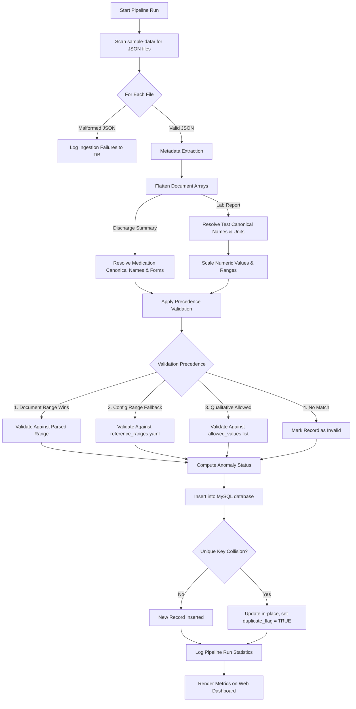

# Veritas Claims (Medical-Data-Standardizer) — Ingestion & Standardisation Engine

An industry-grade, configuration-driven ETL pipeline and operational dashboard built to ingest, validate, and standardize unstructured medical claims data (discharge summaries and lab reports) into a unified MySQL schema.

---

## 1. System Pipeline Architecture

This diagram shows how files flow through the ETL pipeline, from ingestion checks to standardisation, validation, and final MySQL persistence.



---

## 2. Core Features

* 🚀 **Zero-Code Onboarding**: The system is completely configuration-driven. New test variations, hospital name aliases, or medication synonyms can be added via the YAML configs without modifying Python code.
* 📏 **Dynamic Unit Scaling (FR-2.4)**: Automatically normalizes numeric values and reference bounds to standard units using mathematical scaling factors (e.g., converting `130 g/L` to `13 g/dL` using a `0.1` scaling factor).
* ⚖️ **Precedence-Based Validation Hierarchy**:
  1. **Document Range (Superior)**: Parses and uses ranges specified directly in the patient's record.
  2. **Config Range (Fallback)**: Reverts to thresholds configured in `config/reference_ranges.yaml`.
  3. **Qualitative Evaluation**: Resolves text-based tests (e.g. Covid19, HIV) using global qualitative allowed lists in `config/analytics_rules.yaml`.
  4. **Invalid**: Flags untracked numeric tests lacking range parameters as `Invalid` for manual clinical audit.
* 🛡️ **Idempotence & Deduplication**: Employs deterministic record IDs (`SHA256` hashing combining key identifiers and array indices) and MySQL `ON DUPLICATE KEY UPDATE` blocks to safely handle re-runs.
* 📊 **Operations Dashboard**: Real-time dark-mode Flask UI displaying KPIs, flagged anomalies, duplicate logs, and audit logs mapping raw inputs side-by-side with resolved canonical entities.

---

## 3. Directory Layout

```
.
├── config/                      # YAML Configuration Dictionaries
│   ├── document_types/          # Structural schemas for doc types
│   │   ├── discharge_summary.yaml
│   │   └── lab_report.yaml
│   ├── analytics_rules.yaml     # Qualitative allowed terms and null aliases
│   ├── field_aliases.yaml       # Aliases for patient demographics
│   ├── medicine_dictionary.yaml # Medication canonical names & forms
│   ├── reference_ranges.yaml    # Numerical ranges & qualitative bounds
│   ├── test_name_dictionary.yaml# Test name synonyms & clinical categories
│   └── unit_conversion.yaml     # Target units and scaling factors
├── database/                    # SQL Schema & Connection logic
│   ├── connection.py            # MySQL pymysql connection manager
│   ├── generate_ddl.py          # Python builder to generate schema script
│   └── schema.sql               # Generated MySQL database tables DDL
├── src/                         # Core ETL pipeline execution
│   ├── db_loader.py             # Database inserts, updates, and truncates
│   ├── ingest.py                # JSON file reader and error logger
│   ├── pipeline.py              # Main orchestrator pipeline
│   ├── standardize.py           # Clinical standardisation & scaling
│   ├── utils.py                 # String matching & hashing utilities
│   └── validate.py              # Numerical parsing & anomaly classification
├── tests/                       # Unit testing suites
│   ├── test_standardize.py      # Standardisation logic tests
│   └── test_validate.py         # Range parser & anomaly classifier tests
├── ui/                          # Flask Dashboard Web Application
│   ├── static/                  # Dark-mode dashboard stylesheet (CSS)
│   ├── templates/               # Jinja2 HTML templates
│   └── app.py                   # Flask server file
├── .env.example                 # Environment variables template
├── .gitignore                   # Excludes venv, cache, and secrets
├── requirements.txt             # Project library dependencies
└── medical_data.pdf             # Compiled source code compilation PDF
```

---

## 4. Quickstart Setup Guide

### Prerequisites
* Python 3.10 or higher
* MySQL Server (running on `localhost:3306`)

### Step 1: Initialize Virtual Environment
Open your terminal in the project directory and create/activate the Python virtual environment:
```powershell
# Create venv
python -m venv .venv

# Activate venv
.\.venv\Scripts\Activate.ps1
```

### Step 2: Install Dependencies
```powershell
pip install -r requirements.txt
```

### Step 3: Configure Database Secrets
1. Copy the `.env.example` template:
   ```powershell
   cp .env.example .env
   ```
2. Edit the newly created `.env` file and insert your actual local MySQL root password:
   ```env
   DB_PASSWORD=your_mysql_password_here
   ```

### Step 4: Build Database Schema
Build and seed the database tables using your MySQL terminal launcher:
```powershell
Get-Content database/schema.sql -Raw | mysql -u root -p
```

---

## 5. Execution Commands

All commands should be executed with the virtual environment active.

### Running the ETL Ingestion Pipeline
* **Incremental Run (Normal)**:
  Runs ingestion normally, updating values in-place and logging duplicates:
  ```bash
  python -m src.pipeline
  ```
* **Fresh Run (Reset)**:
  Truncates database clinical tables cleanly before performing a fresh load:
  ```bash
  python -m src.pipeline --reset
  ```

### Launching the Dashboard App
Start the Flask web dashboard locally:
```bash
python ui/app.py
```
Open your browser and navigate to: **`http://localhost:5000`**

### Running Unit Tests
Validate code correctness using Python's standard test wrapper:
```bash
python tests/test_standardize.py
python tests/test_validate.py
```
