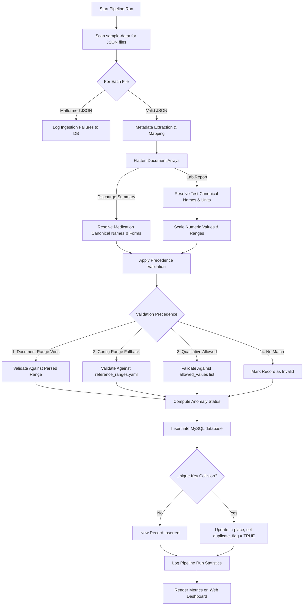

# Project Documentation: Veritas Claims Ingestion & Standardisation Engine

Welcome to the official developer and architecture documentation for the **Veritas Claims (Medical-Data-Standardizer)**. This document serves as a comprehensive guide for developers, clinical auditors, and interviewers to understand the system design, data flow, engineering decisions, and operational capabilities of this platform.

---

## 1. Executive Summary

In healthcare and insurance tech, clinical data arrives from thousands of clinics and labs in highly unstructured, inconsistent, and messy formats (different units, spelling variations, layout structures, and typos). 

The **Veritas Claims Ingestion & Standardisation Engine** is an enterprise-grade, configuration-driven ETL pipeline and web dashboard designed to:
1. **Ingest** raw, unstructured medical claims (discharge summaries and lab reports) in JSON format.
2. **Standardise** demographic and clinical data (e.g. converting tests and medications to canonical names, and resolving spelling variations using fuzzy Levenshtein distance).
3. **Normalize Units** dynamically to standard medical units using mathematical scaling rules.
4. **Validate** results using a precedence-based clinical rule hierarchy (identifying normal results, outliers, anomalies, and unparseable text).
5. **Deduplicate** records using deterministic SHA256 hashing to guarantee pipeline idempotency.
6. **Persist** clean standardized rows into a normalized MySQL schema.
7. **Monitor and Audit** pipeline runs, ingestion errors, and flagged clinical anomalies via a real-time dark-mode web dashboard.

---

## 2. System Architecture & Data Flow

The pipeline uses a multi-tier, decoupled ingestion strategy. Below is the technical data flow outlining how a raw payload is processed, transformed, validated, and persisted.

### Ingestion Flow Diagram



### Components

* **Ingestion Layer (`src/ingest.py`)**: Reads input files and parses demographic details. Resolves structural layouts using configurations defined in `config/document_types/`. If a file is malformed or missing key metadata, it fails early and logs the failure to the audit trail.
* **Standardisation Layer (`src/standardize.py`)**: Uses string-similarity calculations and dictionaries to normalize test names, medications, genders, and dates. It also runs numeric extraction and unit conversion.
* **Validation Layer (`src/validate.py`)**: Implements numeric range parsers, qualitative check algorithms, and outlier detection logic to flag anomalies.
* **Database Operations (`src/db_loader.py`)**: Manages transactions, pipeline run statistics, error logging, and idempotent data loads using MySQL.
* **Operations Dashboard (`ui/app.py`)**: Provides a Flask-powered user interface for real-time analytics, record search/inspection, audit trails, and PDF/CSV report exports.

---

## 3. Data Model & Database Schema

The system uses a highly queryable, flattened schema design. Clinical records are exploded at the individual test/medication grain (one row per test or medication entry) to support fast relational analysis.

### Primary Tables (`database/schema.sql`)

#### 1. `standardized_records`
Stores the flattened, standardized clinical entries.

| Column | Type | Description |
| :--- | :--- | :--- |
| `id` | `VARCHAR(64)` | Deterministic SHA256 primary key hash (Claim No + Doc ID + Record Type + Clinical Name). |
| `claim_no` | `VARCHAR(128)` | Cross-system identifier representing the claims case. |
| `document_id` | `VARCHAR(128)` | Unique document identifier from the origin clinic. |
| `record_type` | `VARCHAR(128)` | `lab_report` or `discharge_summary`. |
| `patient_name` | `VARCHAR(128)` | Normalized patient name. |
| `age` | `VARCHAR(128)` | Standardized age field. |
| `gender` | `VARCHAR(128)` | Standardized gender (`Male`, `Female`, `Other`, or preserved redactions). |
| `hospital_name` | `VARCHAR(128)` | Normalized hospital name (resolved via alias config). |
| `test_name_canonical` | `VARCHAR(128)` | Resolved canonical clinical entity (e.g. `HAEMOGLOBIN`). |
| `test_name_original` | `TEXT` | Raw clinical test name as read from input. |
| `result_value` | `DOUBLE` | Numerically parsed result value (null for text/qualitative tests). |
| `result_text` | `TEXT` | Raw result text from input. |
| `unit_canonical` | `VARCHAR(128)` | Target normalized unit (e.g., `g/dL` for Hemoglobin). |
| `unit_original` | `VARCHAR(128)` | Original raw unit read from input. |
| `range_low` / `range_high`| `DOUBLE` | Parsed numeric boundaries. |
| `test_analytics` | `VARCHAR(128)` | Processing result status (`Within Range`, `Below Range`, `Above Range`, `Outlier`, `Invalid`). |
| `normalization_method`| `VARCHAR(128)` | Tracking code for resolution (`exact_alias`, `fuzzy_match`, `unmapped_fallback`). |
| `medicine` | `VARCHAR(128)` | Canonical medicine name (Discharge Summary only). |
| `dose` / `frequency` | `VARCHAR(128)` | Prescribed dosage and frequency. |
| `processing_status` | `VARCHAR(16)` | `processed` or `flagged`. |
| `duplicate_flag` | `BOOLEAN` | `TRUE` if this record is a duplicate run of an existing claim entry. |

#### 2. `ingestion_errors`
Maintains an audit trail for file ingestion failures (malformed JSON schemas, unhandled runtime exceptions) to ensure no source file is dropped silently.

#### 3. `pipeline_runs`
Logs run metadata (start/finish timestamps, total files seen, files processed successfully, files failed, records flagged, and duplicates skipped) to monitor operational health.

---

## 4. Configuration-Driven Standardization

The engine is built on a **Zero-Code Onboarding** principle. To adapt to new hospitals, new test names, or altered guidelines, developers update YAML files in the `config/` directory without writing Python code:

1. **`document_types/`**: Maps input JSON keys to canonical schema fields dynamically for different document structures.
2. **`field_aliases.yaml`**: Standardises patient demographic headers (e.g., mapping `"patientFullName"`, `"patName"`, `"patient"` to `"patient_name"`).
3. **`test_name_dictionary.yaml`**: Contains standard clinical tests, their category, default target units, and known aliases/typos.
4. **`medicine_dictionary.yaml`**: Maps common medication brand names and typos to their canonical generic drug names.
5. **`unit_conversion.yaml`**: Stores target clinical units and decimal scaling factors (e.g., standardizing `g/L` to `g/dL` using a `0.1` multiplier).
6. **`reference_ranges.yaml`**: Contains normal/outlier thresholds and qualitative parameters, supporting gender-specific bounds.

---

## 5. Core Business & Clinical Logic

### Canonical Standardization & Fuzzy Matching
The engine resolves input strings using a tiered matching algorithm:
* **Tier 1: Exact Alias Matching**: Compares clean lowercase strings with dictionary entries.
* **Tier 2: Levenshtein Distance Fuzzy Matching**: If exact matching fails, calculates similarity. If similarity $\ge 80\%$, standardizes it to the canonical term and marks it as `fuzzy_match`.
* **Tier 3: Fallback**: If no match is found, uppercase original values are preserved as `unmapped_fallback` to prevent data loss.

### Dynamic Unit Conversion
When raw results arrive with alternative units, the system checks `config/unit_conversion.yaml`. If a conversion path exists, it:
1. Multiplies the numeric value by the configured scaling factor.
2. Multiplies the parsed reference low/high bounds by the same scaling factor.
3. Overrides the canonical unit field to the standard target.

### Precedence-Based Validation Hierarchy
To evaluate whether a test is normal, abnormal, or an outlier:
1. **Document Range (Highest Priority)**: If the incoming lab record contains a range (e.g. `12.0 - 16.0`), it is parsed and used.
2. **Config Range (Fallback)**: If no document range is parsed, the engine checks `config/reference_ranges.yaml` for gender- or age-specific ranges matching the canonical test.
3. **Qualitative Verification**: If the test is text-based (e.g. `COVID19: Positive`), it checks against allowed qualitative categories.
4. **Mark Invalid**: If a numeric test has no range defined anywhere, it is flagged as `Invalid` for human audit.

---

## 6. Web Operations Dashboard

Built using a Flask backend and an optimized dark-mode CSS theme, the dashboard provides administrators and clinical reviewers with full visibility into the ingestion stream.

 *Visual schema and system pipeline reference diagram.*

### Key Features
* **KPI Header Cards**: Real-time counts of files processed, ingestion failures, total database rows, flagged anomalies, and duplicate runs.
* **Audit Logs / Ingestion Errors Page**: A list of files that failed parsing, displaying the exact Python stack trace, stage, and raw payload.
* **Interactive Records Search**: Paginated, filterable grid to search by claim number, document ID, patient name, record type, and processing status.
* **Single-Record Inspector**: Click a record to open a modal displaying raw metadata side-by-side with resolved canonical values.
* **Flagged Queue**: An inbox for clinical reviewers. Showcases records marked as `Below Range`, `Above Range`, `Outlier`, or `Invalid` due to unparseable values.
* **Reports Export**: Generates and downloads paginated PDF reports or CSV audit files from the current page view.

---

## 7. Setup & Run Instructions

### Prerequisites
* Python 3.10+
* MySQL Server running on `localhost:3306`

### Installation Steps

1. **Activate Virtual Environment**:
   ```powershell
   python -m venv .venv
   .\.venv\Scripts\Activate.ps1
   ```
2. **Install Dependencies**:
   ```powershell
   pip install -r requirements.txt
   ```
3. **Environment Setup**:
   Create a `.env` file from the template and configure your MySQL credentials:
   ```env
   DB_HOST=localhost
   DB_PORT=3306
   DB_USER=root
   DB_PASSWORD=your_mysql_password
   DB_NAME=medical_data_standardisation
   ```
4. **Seed Database Schema**:
   Run the generated SQL script on your MySQL server:
   ```powershell
   Get-Content database/schema.sql -Raw | mysql -u root -p
   ```

### Execution Commands

* **Run the ETL Pipeline (Incremental)**:
   ```powershell
   python -m src.pipeline
   ```
* **Run the ETL Pipeline (Clear & Fresh Reload)**:
   ```powershell
   python -m src.pipeline --reset
   ```
* **Launch the Web Dashboard**:
   ```powershell
   python ui/app.py
   ```
   Open **`http://localhost:5000`** in your browser.
* **Run the Unit Test Suites**:
   ```powershell
   python tests/test_standardize.py
   ```

---

## 8. Clinical Safety & Audit Capabilities

Standardization must never happen silently behind the scenes. This platform ensures clinical safety in two ways:
1. **The Ingestion Errors Log**: Tracks files containing corrupt structures or missing key demographics (e.g. missing `patientName`). This prevents claims from being lost in the system.
2. **The Flagged Anomalies Queue**: Any clinical item that is out of bounds or has an unparseable result (such as textual values where numbers were expected) is diverted here. A human clinical editor can inspect the audit trail, examine raw vs. canonical outputs, and manually approve or reject the claim.

---

## 9. Future Production Architecture Additions

For enterprise-scale production, the following enhancements are planned:
1. **Dynamic Config Generation via LLM**: Integrating Google Gemini to parse uploaded raw files, automatically generate new alias and dictionary configuration entries in `config/`, and save them. This eliminates the need to manually build YAML files for new clinics.
2. **Standard Vocabulary Mapping**: Seeding dictionaries using clinical standards (LOINC for lab tests, RxNorm/Snomed-CT for medications).
3. **Cloud Native Storage**: Replacing local disk polling with cloud object stores (Google Cloud Storage or AWS S3) triggering automated cloud functions (e.g. Cloud Run, AWS Lambda) upon file upload.
